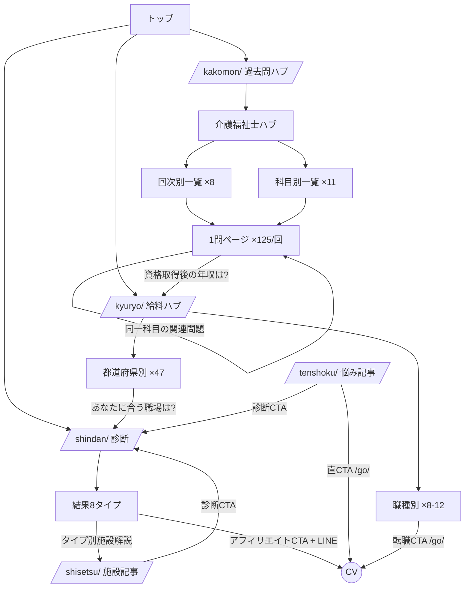

# 03. サイト構造・情報設計

> URL・ディレクトリ・内部リンク・ページテンプレートの正式仕様。以降の全章はこのURL規則を正とする。

## 1. ドメイン・サイト名(2026-07-04 ユーザー決定済み)

| 項目 | 決定 | 備考 |
| --- | --- | --- |
| サイト名 | **マモリビ**(守り火) | 100候補→TOP20→実査で選定。称呼「マモリビ」の先行商標登録は0件(patent-i.com 確認、2026-07-04)。商標出願(35類: 求人情報の提供・広告 / 41類: 電子出版物 / 44類: 介護情報の提供)は未着手 — 弁理士経由で早期出願を推奨 |
| ドメイン | **`mamoribi.jp`**(取得済み) | 新規取得(中古ドメインではない)。混同懸念先として mamoribi.com「まもり灯」(孤独死防止LINE通知・商標未登録)と「まもりびクリニック」(東京)が存在 — 商標出願時に弁理士へ共有すること |
| リポジトリ | `projects/kaigo-media/`(確定) | 2026-07-04 ユーザー明示指示で確定(親 CLAUDE.md 記載) |

## 2. URL設計(正式仕様)

原則: 全URL小文字・ローマ字スラッグ・末尾スラッシュ統一・階層は原則3(過去問の1問ページのみ4を許容)。**一度公開したURLは変更しない**(過去問・統計ページは年次でURLが増えるだけの設計にする)。

```
/                                     トップ(ハブへの入口 + 新着 + 診断導線)

/kakomon/                             C1: 過去問ハブ
/kakomon/kaigofukushishi/             └ 介護福祉士 試験ハブ(制度解説・合格点推移・全回次一覧)
/kakomon/kaigofukushishi/38/          └ 回次別一覧(第38回=2026年1月実施)
/kakomon/kaigofukushishi/38/q001/     └ 1問1ページ(q001〜q125)
/kakomon/kaigofukushishi/s/<subject>/ └ 科目別一覧(13科目・第38回以降はA/B/Cパート軸でも絞り込み可能にする)
/kakomon/kaigofukushishi/drill/<topic>/ └ 【予約領域】オリジナル一問一答(R-01 プランB発動時および初任者研修等の非公開試験用)
/kakomon/caremane/                    └ ケアマネ試験(構造は介護福祉士と同一、60問)
/kakomon/caremane/27/q001/

/kyuryo/                              C3: 給料ハブ(全国サマリー + 都道府県/職種への入口)
/kyuryo/pref/hokkaido/ … /okinawa/    └ 都道府県別統計ページ(47。スラッグはヘボン式)
/kyuryo/job/kaigofukushishi/ 等       └ 職種・資格別統計ページ(8〜12)
/kyuryo/guide/<slug>/                 └ 給料系の解説記事(例: /kyuryo/guide/yakin-teate/)
                                        ※ pref / job / guide はデータ駆動ページとの衝突を防ぐ予約語。
                                          記事スラッグには使用禁止(全クラスタ共通の予約語リストとして管理)

/shikaku/<slug>/                      C2: 資格・研修記事(例: /shikaku/shoninsha-kenshu-hiyo/)
/tenshoku/<slug>/                     C4: 悩み・退職・転職記事(例: /tenshoku/yametai/)
/shisetsu/<slug>/                     C5: 施設種別記事(例: /shisetsu/tokuyo-rouken-chigai/)
/shokushu/<slug>/                     C6: 職種図鑑(例: /shokushu/seikatsu-sodanin/)

/shindan/                             C7: 適性診断(既存 aff-v1 の15問診断を移植)
/shindan/result/<type>/               └ 結果8タイプ(tokuyo/rouken/dayservice/homecare/paidhome/nightshift/beginner/caremanager)

/go/<slug>                            アフィリエイトリダイレクタ(302。既存実装を移植。robots.txt で Disallow、
                                        リンク側は全て rel="sponsored nofollow" を必須とする → 05章 §3)

/about/                               運営者情報(E-E-A-T 基盤)
/editorial-policy/                    編集ポリシー・監修体制・広告掲載方針(PR表記の根拠ページ)
/supervisor/<slug>/                   監修者プロフィール(Person 構造化データ)
/contact/  /privacy/  /terms/
```

科目スラッグ表(介護福祉士11科目群)は [06章 §2](./06-data-model.md) のマスタで一元管理し、URLとの対応を固定する。

### URL設計の判断メモ

- 過去問は「回次(第N回)」を正とする(受験者の語彙は「第37回」であり年度ではない)。年号での検索意図はページタイトル側で吸収(例:「第37回(2025年1月実施)」)。
- `/kyuryo/pref/<pref>/<job>/`(都道府県×職種の掛け算 = 最大564ページ)は **Phase 3 まで作らない**。データの粒度が粗いままページだけ増やすとシンコンテンツ化するため、47ページの実績(順位・PV)を見てから判断する。
- 既存 aff-v1 の `/result/<type>` ではなく `/shindan/result/<type>` に変更(トップ階層の乱立を防ぐ)。
- 権利処理等で問題を非掲載にする場合(`status: 'excluded'` → [06章](./06-data-model.md))、当該問題番号は**欠番として扱う**: 一覧には「問N(権利処理のため非掲載)」と表示し、1問ページの前後リンクは欠番をスキップする。URLは発行しない(404)。

### 旧サイト(aff-v1-kaigo-shindan)の処遇 — 重複コンテンツ対策

「別ドメインだからリダイレクト不要」は誤り。診断・結果8ページ・コラムを新サイトへ移植した状態で旧サイトを放置すると、**2ドメイン間のほぼ完全な重複コンテンツ**となり、新ドメインが正規URLを取れない・評価が分散するリスクがある。

- **推奨(本設計の前提)**: 新サイト公開と同時に、旧サイトの全URLを新URL体系へ301リダイレクト(`/diagnosis`→`/shindan/`、`/result/<type>`→`/shindan/result/<type>/`、コラム→対応記事、`/tiktok`→新サイトの対応入口)。旧ドメインのリダイレクトは1年以上維持する。
- 併存させる場合(非推奨): 旧サイト側の重複ページを noindex 化するか、canonical を新ドメインへ向ける方針を公開前に確定する。
- この決定は最終的にユーザー確認事項(README「未決事項」に登録)。

## 3. トピッククラスタ構造(内部リンク設計)



### 内部リンクの規則(制作時のチェックリスト)

1. トップから**過去問1問ページは4クリック以内、それ以外は3クリック以内**で到達可能にする(1問ページはトップ→過去問ハブ→回次一覧→1問で構造上4クリックになるため。監査ツールの閾値もこの2段構えにする)。試験期(11〜2月)はトップに最新回次一覧への**直接リンク**を置き、実質2クリックに短縮する。
2. 1問ページには最低4本の内部リンク: ①前後の問題 ②同一科目の一覧 ③回次一覧 ④文脈に合う記事1本(科目→記事のマッピング表を [06章](./06-data-model.md) のデータで管理)。
3. 記事は公開時に**必ず既存記事から1本以上のリンクを受ける**(孤立ページ禁止。監査は自動化ツールで行う → [10章 §2](./10-implementation-order-and-tools.md))。
4. パンくずは全ページ設置し `BreadcrumbList` 構造化データと一致させる。
5. アンカーテキストはクエリ語彙に寄せる(「こちら」禁止)。

## 4. ページテンプレート一覧

| テンプレート | 対象URL | 主要ブロック(上から順) |
| --- | --- | --- |
| T1: トップ | `/` | H1+サイト価値提案 / 診断CTA / 過去問・給料ハブカード / 新着・人気記事 |
| T2: 過去問ハブ | `/kakomon/`, 試験ハブ | 試験概要(合格点・日程の最新ファクト) / 回次別・科目別リンク / 勉強法記事リンク |
| T3: 問題一覧 | 回次別・科目別 | 一覧テーブル(問題番号・冒頭文・正答率※実装可なら) / ページ内絞り込み(第38回以降はA/B/Cパートでも絞り込み) / 欠番は「非掲載(権利処理)」表示 |
| T4: 1問ページ | `/kakomon/**/qNNN/` | 問題文 / 選択肢(タップで解答表示。**正解・解説は初期HTMLに含めCSS制御** → [05章 §4](./05-technical-seo.md)) / 正解 / オリジナル解説(監修・定量基準は [04章 F1](./04-content-strategy.md)) / 関連問題 / 弱CTA(講座資料請求・診断) |
| T5: 給料統計 | `/kyuryo/pref/**`, `/kyuryo/job/**` | サマリー数値(平均給与・全国比) / グラフ(引用・埋め込み歓迎の明記で被リンク獲得) / 出典・調査年表記 / 給料を上げる選択肢→転職CTA |
| T6: 記事 | `/shikaku/ /tenshoku/ /shisetsu/ /shokushu/ /kyuryo/guide/` | リード(結論先出し) / 目次 / 本文(H2×3〜6) / 監修者・執筆者ボックス / FAQ / CTA(クラスタ別に規定 → [07章](./07-conversion-design.md)) |
| T7: 診断・結果 | `/shindan/**` | 既存 aff-v1 のUIを踏襲(QuestionCard / ProgressBar / ResultCard / LineCta)。結果ページは独自本文1,000字以上を備えるまで noindex([05章 §3](./05-technical-seo.md)) |
| T8: 監修者 | `/supervisor/<slug>/` | 顔写真 / 資格・経歴 / 監修記事一覧 / SNS・外部実績リンク |

## 5. ナビゲーション・回遊設計

- ヘッダー: ロゴ / 過去問 / 給料 / 転職ガイド / 診断(強調ボタン)。スマホはボトム固定ではなくハンバーガー+記事内CTAで誘導(広告的すぎるUIはYMYL評価でマイナス)。
- フッター: 全ハブ+ `/about/` `/editorial-policy/` 等の信頼系ページを必ず露出(品質評価者が運営者情報へ到達しやすくする)。
- 過去問ページの回遊: 「次の問題へ」を最優先ボタンにする(演習の連続性 = セッションPVの最大化。1セッション5〜15PVを狙う【仮説 H-02 関連】)。

---

- 前: [02. キーワード戦略](./02-keyword-strategy.md)
- 次: [04. コンテンツ戦略・編集ガイドライン](./04-content-strategy.md)
