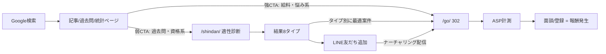

# 07. コンバージョン設計(アフィリエイト)

> CVR・報酬単価の数値は **すべて【仮説】**。ASP 提携後に実数で上書きする。

## 1. ファネル全体像



- **2階建てファネル**: ①検索意図が転職に近いページは直CTA、②意図が遠いページ(過去問・資格)は診断・LINEを挟んで温める。既存 aff-v1 の資産(15問診断・8タイプ・LineCta・/go/ リダイレクタ・GA4 `affiliate_click` イベント)をそのまま移植する。
- LINE は「即転職ではない層」の資産化装置。試験期に獲得した受験生を、合格発表後(3月)の転職シーズンに配信で刈り取る(**過去問クラスタのCV化はこの時間差が本体**)。

## 2. 案件ポートフォリオ

| slug(/go/) | 案件 | ASP(確認先) | 想定報酬 | 主な訴求先クラスタ |
| --- | --- | --- | --- | --- |
| `leverwell` | レバウェル介護 | PRESCO ほか([どこアフィ検索](https://dokoafi.com/?p=58291) 確認日 2026-07-04) | 5,000〜15,000円/CV【仮説 H-07】 | C4 悩み・C3 給料 |
| `mynavi` | マイナビ介護職 | A8.net([A8 掲載事例](https://www.a8.net/ec/casestudy/23/) 確認日 2026-07-04) | 同上【仮説 H-07】 | C4・C6(有資格者向け) |
| `kaigobatake` | かいご畑 | 要確認 | 同上【仮説 H-07】 | C2 資格(無資格・未経験訴求) |
| `kaigoworker` | 介護ワーカー | 要確認 | 同上【仮説 H-07】 | C4・C5 |
| `shikatoru` | シカトル(介護資格の資料一括請求) | 要確認 | 資料請求系は成果地点が軽く単価は低め(数百〜2,000円)【仮説 H-07】 | C1・C2(学習中ユーザーにノイズにならない) |
| `brushup` | BrushUP学び(講座比較・資料請求) | 要確認 | 同上【仮説 H-07】 | C1・C2 |

- 単一案件依存を避け**常時3案件以上**を維持(案件終了リスク [R-04](./09-hypotheses-and-risks.md#r-04))。
- 成果地点(登録のみ/面談実施/稼働)が案件ごとに違うため、提携時に成果条件・承認率を台帳化し、EPC(クリック単価換算)で比較して掲載順を決める。承認率は30〜70%と幅がある【仮説 H-23】。

## 3. クラスタ別CTA設計

| クラスタ | CTA強度 | 一次CTA | 二次CTA | 根拠 |
| --- | --- | --- | --- | --- |
| C4 悩み・退職 | 強 | エージェント直(共感文脈で「相談」訴求) | 診断 | 転職意欲が最も高い |
| C3 給料 | 強 | エージェント直(「給料を上げる具体策」の1つとして提示) | 給料統計ページ回遊 | 給料クエリは比較・行動に近い検索意図(離職理由としては収入は4位16.6% — [02章 C3](./02-keyword-strategy.md) のファクト参照) |
| C2 資格 | 中 | かいご畑(資格支援)+ 講座資料請求(シカトル/BrushUP) | 診断 | 無資格層は「働きながら資格」訴求が刺さる |
| C5 施設種別 | 中 | 診断(「あなたはどの施設向き?」) | エージェント | 比較検討層は診断で自分事化 |
| C1 過去問 | 弱 | 講座資料請求(実務者研修比較)or 診断 or LINE(「合格後のキャリア」文脈) | なし | 学習中に転職CTAはノイズ。講座系は学習文脈と一致するため許容。LINE一本足への依存を避ける |
| C6 職種図鑑 | 中 | 資格記事へ回遊 → エージェント | 診断 | ステップ導線 |

- CTA配置: 記事は「結論直後」と「記事末」の2箇所まで。過去問ページは解説末尾に1箇所のみ。追従バナー・ポップアップは使わない(YMYL×広告過多はページ品質評価を毀損)。
- `/go/` へのリンクは全て `rel="sponsored nofollow"`(コンポーネントで強制 → [05章 §3](./05-technical-seo.md))。

### 計測イベントスキーマ(正式仕様 — 実装・GA4設定はこの表を正とする)

既存 aff-v1 の実装はパラメータ名が揺れている(`provider` / `source_page` / CLAUDE.md 上は `affiliate_slug`)ため、移植時に以下へ統一する。

| イベント | パラメータ | 発火箇所 |
| --- | --- | --- |
| `affiliate_click` | `affiliate_slug`(=/go/ の slug), `cluster`(c1〜c7), `position`(lead / body / footer / result), `result_type`(診断結果ページのみ) | AffiliateLink コンポーネント |
| `line_click` | `cluster`, `source_page` | LineCta コンポーネント |
| `diagnosis_complete` | `result_type` | 診断完了時 |

- **GA4 でカスタムディメンション登録をしない限りこれらのパラメータはレポートに出ない**。登録作業(4パラメータ)を [10章 §1 #4](./10-implementation-order-and-tools.md) の作業項目に含める。
- LINE経路の計測: `lin.ee` 短縮URLのクエリはLINE側の流入計測に反映されないため、**経路別に別の友だち追加URL/QRを発行**(LINE公式アカウントの流入経路機能)して「過去問経由」「診断経由」を分離する。それが運用上難しい場合、H-11 の検証は GA4 `line_click`(クラスタ別)を代理指標とする。

## 4. 収益モデル(仮説の連鎖 — 全数値要検証)

**基数はCV対象PV(=非過去問PV 約30万)であり、100万PVではない**(過去問70万PVはクリック率が桁で低いため式から除外し、LINEで別管理)。

```
CV対象PV 約30万(試験期100万PVのうち過去問70万を除く)
× アフィリンク到達ページ比率 60%【仮説 H-24】 → 18万PV
× リンククリック率 1.5〜3%【仮説 H-05】     → 2,700〜5,400クリック
× クリック→CV率 3〜8%【仮説 H-06】          → 81〜432 CV
× 承認率 30〜70%【仮説 H-23】               → 24〜302 承認
× 報酬単価 5,000〜15,000円【仮説 H-07】
= 月間収益レンジ: 約12万円(全下限)〜 約450万円(全上限)。現実的中央値シナリオ: 60〜150万円【仮説 H-25】
```

- 過去問クラスタはLINE登録数(月間登録 = 過去問PV×0.3〜1%【仮説 H-11】)で別管理し、LINE→CV率(配信あたり0.5〜2%【仮説 H-11】)+講座資料請求CVで評価する。
- 月次で実測値に置き換え、[08章](./08-kpi-roadmap.md) のKPIツリーを更新する。

## 5. 法令・規約遵守

- ステマ規制対応のPR表記(全該当ページ冒頭)— [04章 §1-3](./04-content-strategy.md)。
- ASP規約: リスティング出稿・LINE配信でのリンク直貼りは案件ごとに可否が異なる → 提携時に「LINE配信での使用可否」を必ず確認(LINEナーチャリングが本設計の要のため。不可の場合はLINE→サイト内ページ→/go/ の2段構成にする)。
- 「おすすめランキング」型ページを作る場合は評価基準を `/editorial-policy/` に明記(景表法・優良誤認の回避)。

---

- 前: [06. データモデル設計](./06-data-model.md)
- 次: [08. KPI・ロードマップ](./08-kpi-roadmap.md)
